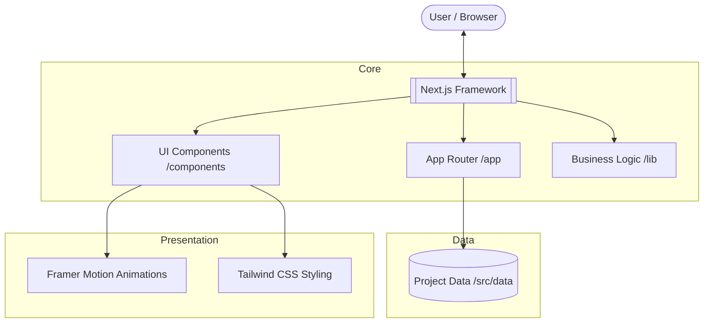
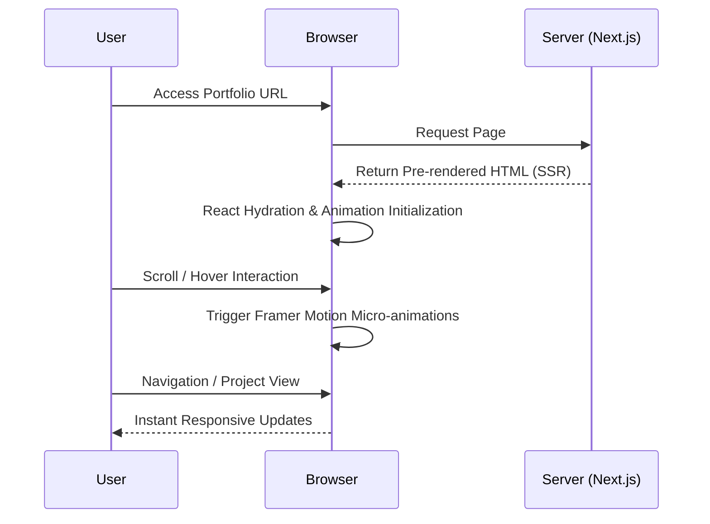

# 🚀 Personal Portfolio | Backend & Full-Stack Developer

Welcome to my personal portfolio. This is a professional showcase of technical expertise, engineering projects, and software development journey, with a strong emphasis on backend and full-stack excellence.

---

## 📝 Project Overview

A responsive portfolio platform designed to present a curated collection of advanced engineering projects. It serves as a digital representation of my skills in Backend, Full-Stack, and AI development, prioritizing clean code, modern architecture, and visual precision.

---

## ✨ Key Features

- **Modern Tech Stack**: Leveraging Next.js 15, React 19, and TypeScript for a robust, type-safe application.
- **Premium UI/UX**: Features a developer-focused aesthetic with glassmorphism, dark mode support, and smooth motion design.
- **Micro-Animations**: Advanced animations and transitions powered by Framer Motion for an engaging user experience.
- **Project Showcase**: Detailed technical breakdown of projects including PCB Defect Detection, Manufacturing Monitoring, and AI-driven systems.
- **Optimized Performance**: Built with server-side rendering (SSR) and semantic HTML for maximum speed and efficiency.

---

## 🏗️ System Architecture

The application is built on a modern, component-driven architecture using the Next.js App Router.



---

## 🛠️ Technology Stack

| Category | Technologies |
| :--- | :--- |
| **Core** | Next.js 15, React 19, TypeScript |
| **Styling** | Tailwind CSS, PostCSS |
| **Animations** | Framer Motion |
| **Tools** | ESLint, Prettier, Lucide React |

---

## 📂 Project Structure

```text
/src
├── /app          # Next.js App Router (Layouts, Pages, Global Styles)
├── /components   # Reusable UI components (Hero, Projects, Navigation)
├── /data         # Static data layers (Projects, Experience, Skills)
├── /lib          # Utility functions and shared helper logic
└── /types        # Centralized TypeScript interfaces
```

---

## 🔄 System Workflow

The following diagram illustrates the user interaction and rendering flow of the portfolio.



---

**Designed and Developed by Nurul Faradila Sazali**
